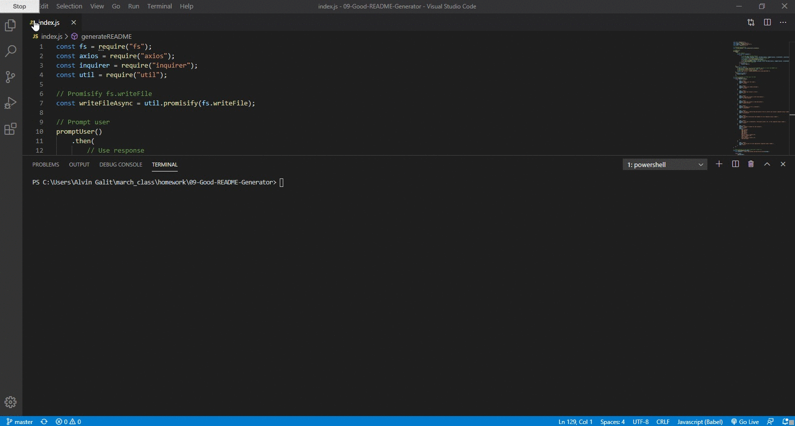

# 09 Good README Generator
> Command-line application for dynamically generating a README.md

This was a homework assignment where we created a command-line application that dynamically generates a README.md from a user's input. The application will be invoked with the following command:

```sh
node index.js
```

The user will be prompted for their GitHub username, which will be used to make a call to the GitHub API to retrieve their profile image. They will then be prompted with questions about their project.

## Completed
* Utilized inquirer for its prompt module
* Utilized axios to make a call to the GitHub API
* Utilized fs to write a file
* Utilized util to promisify the writeFile module
* Designed the template for the README
* Utilized async promise
* Functional, deployed application.
* GitHub repository with a unique name and a README describing project.
* The generated README includes a bio image from the user's GitHub profile.
* The generated README includes the following sections: 
  * Title
  * Description
  * Table of Contents
  * Installation
  * Usage
  * License
  * Contributing
  * Tests
* The generated README includes at least 1 badge that's specific to the repository.


## User Story

```
AS A developer

I WANT a README generator

SO THAT I can easily put together a good README for a new project
```


## Acceptance Criteria

```
GIVEN the developer has a GitHub profile and a repository

WHEN prompted for the developer's GitHub username and repo specific information

THEN a README for the repo is generated
```
- - -

## Animated GIF
